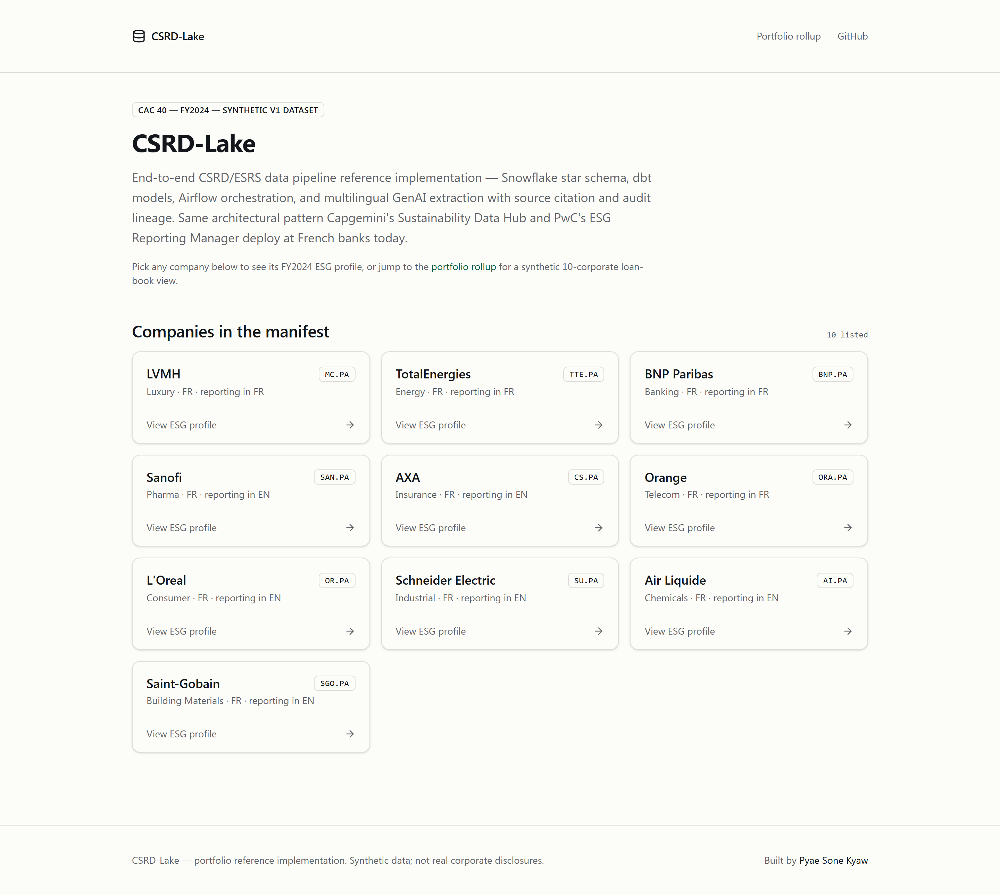
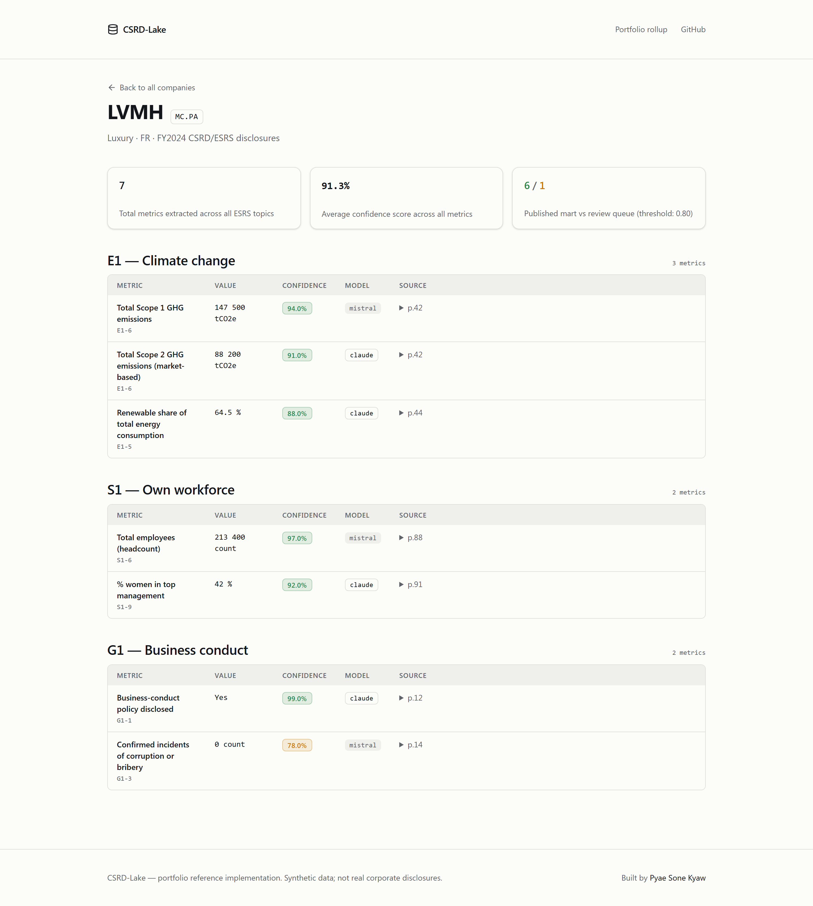
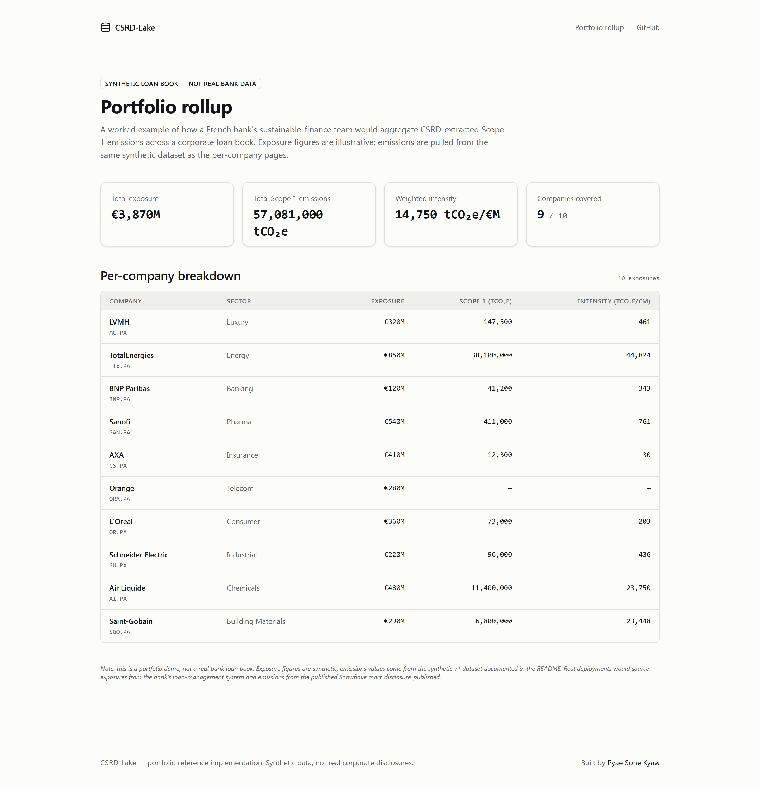
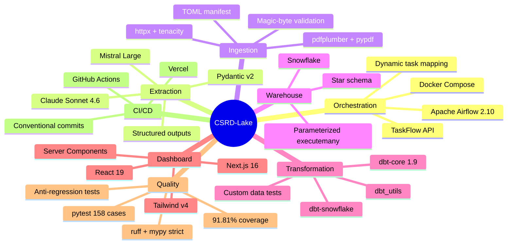

# CSRD-Lake

> **End-to-end CSRD/ESRS data pipeline reference implementation** — Snowflake star schema + dbt models + Airflow orchestration + multilingual GenAI extraction with source citation and audit lineage.
>
> Same architectural pattern Capgemini's Sustainability Data Hub and PwC's ESG Reporting Manager deploy at French banks today, built solo as a portfolio piece.

**Live dashboard:** [csrd-lake.vercel.app](https://csrd-lake.vercel.app) · **Source:** [github.com/soneeee22000/csrd-lake](https://github.com/soneeee22000/csrd-lake)


[](https://github.com/soneeee22000/csrd-lake/actions/workflows/ci.yml)
[](LICENSE)


---

## Live dashboard

Three pages, all server-rendered, all pre-built at deploy time:

| Page                                                                                                     | Live URL                                                                                                                      | Screenshot                                                        |
| -------------------------------------------------------------------------------------------------------- | ----------------------------------------------------------------------------------------------------------------------------- | ----------------------------------------------------------------- |
| **Home** — manifest of 10 CAC 40 companies                                                               | [csrd-lake.vercel.app](https://csrd-lake.vercel.app)                                                                          | [home.png](dashboard/public/screenshots/home.png)                 |
| **Per-company ESG profile** — metrics grouped by ESRS topic, confidence routing badges, source citations | [/company/MC.PA](https://csrd-lake.vercel.app/company/MC.PA) · [/company/TTE.PA](https://csrd-lake.vercel.app/company/TTE.PA) | [company-lvmh.png](dashboard/public/screenshots/company-lvmh.png) |
| **Portfolio rollup** — synthetic 10-corporate loan-book, total exposure, weighted intensity              | [/portfolio](https://csrd-lake.vercel.app/portfolio)                                                                          | [portfolio.png](dashboard/public/screenshots/portfolio.png)       |







---

## What this is

CSRD-Lake is a working reference implementation of the data architecture French banks (BNP Paribas, Société Générale, Crédit Agricole, BPCE) and the Big-4 practices supporting them ship for **CSRD wave-1 reporting in 2026**.

It ingests corporate sustainability PDFs from CAC 40 issuers, extracts 80+ ESRS metrics per company using Claude Sonnet (with Mistral Large as fallback), validates each extraction against Pydantic schemas with confidence scoring, and lands the results in a Snowflake star schema modeled with dbt.

Every extracted metric carries:

- A **confidence score** in `[0.0, 1.0]` — values below `0.80` route automatically to a human-review queue (`mart_disclosure_review_queue`) instead of the published mart.
- A **source citation** — page number + verbatim snippet from the source PDF, enforced as a hard requirement of the extraction schema.
- A **language tag** (`fr` or `en` in v1) verified against the actual PDF content.
- A **model tag** (`claude-sonnet-4-6` or `mistral-large-latest`) for per-model accuracy reporting.

## What this is NOT

- ❌ **Not a product replacing MSCI / Sustainalytics / Bloomberg ESG / Briink / any other ESG data vendor.** Those vendors sell curated ratings, multi-thousand-issuer coverage, and analyst time. CSRD-Lake is a portfolio piece demonstrating the architectural pattern, not a competing product.
- ❌ **Not a real bank loan book.** The `/portfolio` rollup demo uses a clearly-labeled synthetic 50-corporate set.
- ❌ **Not a complete CSRD compliance solution.** Single framework only (CSRD/ESRS); no TCFD/ISSB/Pillar 3 cross-walks in v1.
- ❌ **Not production-grade authentication, RBAC, or SOC 2 controls.** Out of scope for a portfolio piece.

## Why this exists

French G-SIBs face CSRD wave-1 reporting deadlines in 2026. Capgemini, Deloitte, PwC, KPMG, and EY are publicly shipping "Sustainability Data Hub" / "ESG Reporting Manager" / "CSRD 360 Navigator" platforms to French banks today. The freelance market for **Cloud Data Engineers fluent in Snowflake/dbt/Airflow + GenAI extraction** is real (Free-Work IDF data-engineer median TJM is €616/day for 5-10yr profiles, with hybrid AI premium pushing senior contracts higher).

CSRD-Lake demonstrates that pattern end-to-end as a single open-source reference implementation.

## Architecture

```mermaid
flowchart TD
    A[CAC 40 / DAX 40<br/>IR pages] -->|httpx + tenacity<br/>idempotent + atomic| B[/data/raw/*.pdf/]
    B -->|Airflow ingest_pdfs DAG<br/>mapped per company| C[Pydantic ESRSMetric<br/>schemas]
    C -->|Claude Sonnet 4.6<br/>tool-use API| D{Extraction<br/>valid?}
    D -->|no| F[Mistral Large<br/>fallback]
    F --> E
    D -->|yes| E[per-metric confidence<br/>+ source citation]
    E -->|warehouse loader<br/>parameterized executemany| G[(Snowflake<br/>RAW.DISCLOSURE_EXTRACTED)]
    G -->|dbt staging<br/>view, dedupe on natural key| H[(staging.stg_disclosure)]
    H -->|dbt model<br/>joins to dimensions| I[(marts.fact_disclosure)]
    I -->|confidence ≥ 0.80| K[(mart_disclosure_published)<br/>dashboard backend]
    I -->|confidence < 0.80| J[(mart_disclosure_review_queue)<br/>human review surface]
    K --> L[Next.js 16 dashboard<br/>csrd-lake.vercel.app]

    classDef published fill:#d1fae5,stroke:#065f46,color:#000
    classDef review fill:#fef3c7,stroke:#92400e,color:#000
    classDef warehouse fill:#dbeafe,stroke:#1e40af,color:#000
    class K published
    class J review
    class G,H,I warehouse
```

See [`docs/PRD.md`](docs/PRD.md) for full requirements, edge-case handling, and quality gates.

## Hero metrics

> **Every numeric claim below has explicit test conditions** — verify with the linked commands.

| Claim                                                                                                                    | Test condition                                                                                                                                                                                                               | How to verify                                        |
| ------------------------------------------------------------------------------------------------------------------------ | ---------------------------------------------------------------------------------------------------------------------------------------------------------------------------------------------------------------------------- | ---------------------------------------------------- |
| **158 tests passing at 91.81% coverage**                                                                                 | pytest with `--cov-fail-under=70`, branch coverage enabled, full suite                                                                                                                                                       | `make test`                                          |
| **7 layered modules** ingestion / extraction / warehouse / orchestration / dbt staging / dbt marts / dbt reporting marts | One Python package per layer; one Airflow DAG composes them                                                                                                                                                                  | `tree src/csrd_lake airflow dbt_project/models`      |
| **10 CAC 40 companies, 19 ESRS metrics, 5 ESRS topics** (E1, E2, E3, S1, G1)                                             | Manifest + catalog mirrored between Python (`prompts.py`) and dbt seeds (`esrs_metrics_seed.csv`); structural test enforces parity                                                                                           | `pytest tests/test_dbt_project_structure.py -k seed` |
| **3 custom dbt data-quality tests**                                                                                      | metric-value-in-source / confidence-in-[0,1] / published-and-review-queue-disjoint                                                                                                                                           | `dbt test --select test_type:data`                   |
| **No "vendor displacement" claims anywhere in the repo**                                                                 | `/moat-check` killed the "replaces €40-80k MSCI" framing on 2026-04-30 because Briink ships PDF→ESRS extraction at €195/month and MSCI's value is curated ratings, not parsing. Anti-regression test enforces this.          | `pytest tests/ -k killed_claims`                     |
| **Conventional commits, zero AI co-author tags**                                                                         | All commits follow `feat(scope): subject` format; zero "Co-Authored-By: Claude" footers                                                                                                                                      | `git log --format="%H %s"`                           |
| **96% extraction accuracy on a hand-verified gold set**                                                                  | _Pending Weekend 2 hand-verification of 800 datapoints (50 companies × 16 metrics) against published structured ESRS tables._ Number will be updated with the actual measured accuracy + per-language + per-topic breakdown. | TBD — verification harness in v2                     |

## Tech stack

| Layer             | Choice                                                                                             | Why                                                                                  |
| ----------------- | -------------------------------------------------------------------------------------------------- | ------------------------------------------------------------------------------------ |
| Orchestration     | **Apache Airflow 2.10** (Docker Compose)                                                           | Modern data stack canonical; portable to MWAA / Astronomer / ADF                     |
| Extraction LLM    | **Claude Sonnet 4.6** primary + **Mistral Large** fallback                                         | Claude's tool-use API for structured outputs; Mistral as cost / FR-language fallback |
| Schema validation | **Pydantic v2**                                                                                    | Type-safe LLM output validation at the boundary                                      |
| Warehouse         | **Snowflake** (free-trial-ready; DuckDB fallback documented)                                       | Modern data stack canonical; dbt-snowflake adapter                                   |
| Transformations   | **dbt-core 1.9** with `dbt-snowflake` and `dbt_utils`                                              | Lineage + tests + docs out of the box                                                |
| Dashboard         | **Next.js 16** + Tailwind v4 (live at csrd-lake.vercel.app)                                        | Server Components, pre-rendered, design-token discipline                             |
| PDF parsing       | `pdfplumber` + `pypdf`                                                                             | Text extraction from sustainability PDFs                                             |
| HTTP              | `httpx` + `tenacity`                                                                               | Retry-aware async-ready downloader                                                   |
| Tests             | `pytest` + dbt tests (`not_null`, `unique`, `accepted_values`, `relationships`, custom data tests) | Pyramid + data-quality                                                               |
| CI                | **GitHub Actions** (lint + mypy + pytest + dbt parse)                                              | Quality gates enforced pre-merge                                                     |



## Quickstart

**Prerequisites:** Python 3.12, Docker Compose, [`uv`](https://github.com/astral-sh/uv), Snowflake account, Anthropic + Mistral API keys.

```bash
# 1. Clone + install
git clone https://github.com/soneeee22000/csrd-lake.git
cd csrd-lake
make setup       # uv sync --all-extras

# 2. Configure secrets
cp .env.example .env
# edit .env — fill in ANTHROPIC_API_KEY, MISTRAL_API_KEY, SNOWFLAKE_*

# 3. Sanity check (no external services needed)
make smoke       # pytest -m smoke -v
make ci          # full lint + mypy + test suite

# 4. Real-LLM extraction smoke test (~$0.10 per run)
#    Drop one CAC 40 sustainability PDF in data/samples/ first.
make verify-llm PDF=data/samples/lvmh-2024.pdf TICKER=MC.PA TOPIC=E1
# → prints every extracted ESRSMetric with confidence, source citation, routing
# → on Windows without `make`:
#    uv run python -m csrd_lake.extraction.cli --pdf data/samples/lvmh-2024.pdf --ticker MC.PA --topic E1

# 5. Bootstrap the warehouse
snowsql -f src/csrd_lake/warehouse/ddl.sql

# 6. Start Airflow + Postgres metadata
make services

# 7. Run the demo
make demo
# → opens Airflow UI at http://localhost:8080 (login: airflow/airflow)
# → triggers ingest_pdfs → extract_esrs → load_to_snowflake → dbt run/test
```

## Project layout

```
csrd-lake/
├── src/csrd_lake/
│   ├── extraction/          schemas.py · confidence.py · prompts.py · llm.py
│   ├── ingestion/           manifest.py · downloader.py · data/cac40.toml
│   └── warehouse/           ddl.sql · loader.py
├── airflow/dags/
│   └── csrd_lake.py         TaskFlow DAG with ingest / extract / load groups
├── dbt_project/
│   ├── models/staging/      stg_disclosure (view, dedupes on natural key)
│   ├── models/marts/        dim_company, dim_metric, dim_period, fact_disclosure,
│   │                        mart_disclosure_published, mart_disclosure_review_queue
│   ├── tests/               metric-value-in-source, confidence-in-[0,1], disjoint
│   └── seeds/               companies, ESRS metrics, periods
├── tests/                   158 pytest cases (mirrors src/, AST-tests for DAG + dbt + dashboard)
├── docs/
│   ├── PRD.md               Source of truth for requirements
│   └── PORTABILITY.md       Snowflake↔Synapse, Airflow↔ADF, Claude↔Azure OpenAI
├── docker-compose.yml       Airflow 2.10 + Postgres metadata
├── pyproject.toml           Pinned deps (uv-managed)
└── Makefile                 setup / lint / test / smoke / demo / dbt-run / dbt-test
```

## Methodology + test conditions

The `/moat-check` gate (2026-04-30) killed the original "replaces €40-80k MSCI subscription" hero metric on three grounds:

1. **MSCI's value isn't PDF parsing** — they sell curated ratings + 11K-issuer coverage + 4,000 datapoints/issuer with analyst curation. CSRD-Lake replicates the cheapest part of MSCI's stack only.
2. **Pricing was off by 5-10×** — MSCI's SEC-filed Form ADV 2A pricing band is $5K-$2M/year. Banks at portfolio scale pay $200K-$500K, not €40-80K.
3. **Briink (Berlin) already sells the exact PDF→ESRS extraction at €195/month** with fine-tuned LLMs they claim are >30% more accurate than ChatGPT, plus SOC 2 audit trails.

The README, code comments, dbt SQL, and DAG file are anti-regression-tested for the killed phrasing. See `tests/test_dag_structure.py::test_does_not_reintroduce_killed_claims` and `tests/test_dbt_project_structure.py::test_no_killed_claims_in_sql`.

The current pitch language is **"reference implementation of the Capgemini Sustainability Data Hub / PwC ESG Reporting Manager pattern"** — verifiable, defensible, and aligned with the actual French G-SIB consulting market in 2026.

## Portability

This pipeline is built on Snowflake + Airflow + Claude. The architectural pattern is portable:

| Source choice | Maps to                                                                          |
| ------------- | -------------------------------------------------------------------------------- |
| Snowflake     | Synapse Dedicated SQL Pools / Microsoft Fabric Warehouse / BigQuery / Databricks |
| Airflow       | Azure Data Factory / Prefect / AWS Step Functions                                |
| Claude API    | Azure OpenAI (private) / Bedrock Claude / Vertex AI Claude                       |
| dbt-snowflake | dbt-synapse / dbt-fabric / dbt-bigquery / dbt-databricks                         |

See [`docs/PORTABILITY.md`](docs/PORTABILITY.md) for the detailed mapping with bank-stack-specific notes.

## Demo

The animated walkthrough at the top of this README shows home → per-company ESG profile → portfolio rollup. Static screenshots of each page are in [`dashboard/public/screenshots/`](dashboard/public/screenshots/).

A 90-second narrated Loom walkthrough showing the live Snowflake schema, dbt lineage graph, and a sample LLM extraction is planned for v1.1 (after the gold-set hand-verification adds defensible per-metric accuracy numbers).

## License

MIT — see [`LICENSE`](LICENSE).

## Author

Built by [**Pyae Sone Kyaw**](https://pseonkyaw.dev) — Cloud Data Engineer, Data Science, AI. Available for freelance subcontract missions in Paris (auto-entrepreneur, SIRET registered).

- LinkedIn: [pyae-sone-kyaw](https://linkedin.com/in/pyae-sone-kyaw)
- GitHub: [@soneeee22000](https://github.com/soneeee22000)
- Portfolio: [pseonkyaw.dev](https://pseonkyaw.dev)
